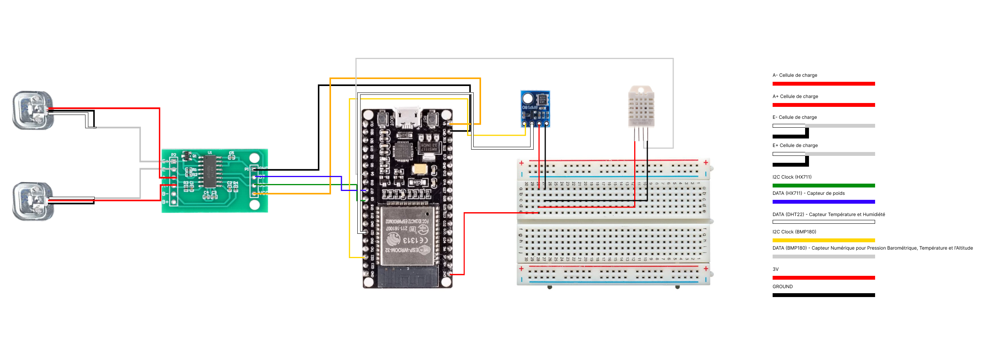

# Projet de surveillance de ruche IoT

Ce projet utilise un ESP32 pour surveiller diverses données d'une ruche, notamment la température, l'humidité, le poids et l'orientation, et envoie ces données via MQTT à un serveur distant.

## Prérequis

- ESP32
- Capteurs :
  - DHT22 (température et humidité) x3
  - BMP180 (pression atmosphérique)
  - HX711 + Cellule de charge (poids)
  - QMC5883L (boussole)
- Broker MQTT
- Arduino IDE

## Branchement

1. Branchez les capteurs DHT22 aux pins suivants :
   - Bas gauche : GPIO 2
   - Haut droit : GPIO 4
   - Extérieur : GPIO 27
2. Branchez le capteur BMP180 en utilisant le bus I2C.
3. Branchez le capteur HX711 aux pins suivants :
   - DOUT : GPIO 5
   - SCK : GPIO 17
4. Branchez le capteur QMC5883L en utilisant le bus I2C.

## Schéma de branchement

Voici un schéma illustrant comment brancher les différents composants de ce projet :

Le schéma inclut :

1. ESP32
2. Capteurs DHT22 (bas gauche, haut droit, extérieur)
3. Capteur BMP180
4. Capteur HX711 avec cellule de charge
5. Boussole QMC5883L

Assurez-vous de respecter les connexions indiquées sur le schéma lors du montage de votre projet.

## Configuration

1. Ouvrez le fichier `src/main.cpp` dans l'Arduino IDE.
2. Modifiez les constantes suivantes selon votre configuration :
   - `ssid` et `password` : informations de connexion à votre réseau WiFi.
   - `mqtt_server` : adresse IP ou nom d'hôte de votre broker MQTT.
   - `mqtt_topic` : topic MQTT sur lequel publier les données.
   - `hive_id` et `user_id` : identifiants uniques pour votre ruche et votre utilisateur.
3. Enregistrez le fichier.

## Flashage

1. Ouvrez le fichier `platformio.ini`.
2. Assurez-vous que la plateforme cible est `esp32dev`.
3. Connectez votre ESP32 à votre ordinateur via USB.
4. Cliquez sur le bouton "Téléverser" dans l'Arduino IDE pour flasher le programme sur votre ESP32.

## Fonctionnement

Une fois flashé et démarré, le programme effectue les actions suivantes en boucle :

1. Se connecte au réseau WiFi et au broker MQTT.
2. Lit les données des capteurs.
3. Publie les données au format JSON sur le topic MQTT spécifié.
4. Attend 1 seconde avant de recommencer.

Les données publiées incluent :

- Température et humidité des trois capteurs DHT22.
- Température et pression du capteur BMP180.
- Poids mesuré par le capteur HX711.
- Orientation (x, y, z) mesurée par la boussole QMC5883L.
- Horodatage Unix de la mesure.

## Maintenance

- Assurez-vous que les capteurs sont propres et correctement positionnés.
- Vérifiez régulièrement les logs du programme pour détecter d'éventuels problèmes de connexion ou de lecture des capteurs.
- Gardez le firmware de l'ESP32 et les bibliothèques Arduino à jour.

## Dépannage

- Si l'ESP32 ne parvient pas à se connecter au réseau WiFi ou au broker MQTT, vérifiez les paramètres de connexion dans le code.
- Si les données des capteurs semblent incorrectes, vérifiez le câblage et les connexions.
- Consultez le fichier `results.txt` pour voir les logs détaillés du programme.

N'hésitez pas à ouvrir une issue sur GitHub si vous rencontrez des problèmes ou avez des suggestions d'amélioration.

## Contributeurs

Ce projet est le fruit d'une collaboration entre plusieurs contributeurs :

### Radu Gheorghiu

- Nombre de commits : 4
- Contributions : conception, choix du matériel, production des schémas et documentation

### Mateo Andre

- Nombre de commits : 4
- Contributions : conception, choix du matériel, production des schémas et documentation

### Pierre Le Gulluche

- Rôle : mainteneur du projet

Nous tenons à remercier chaleureusement tous les contributeurs pour leur travail et leur dévouement à ce projet. Leur expertise et leur collaboration ont été essentielles pour mener à bien ce projet IoT de surveillance de ruche.

Si vous souhaitez contribuer à ce projet, n'hésitez pas à ouvrir une issue ou une pull request sur notre dépôt GitHub. Nous apprécions toutes les formes de contributions, qu'il s'agisse de code, de documentation, de tests, de rapports de bugs ou de suggestions d'amélioration.

Merci à tous pour votre soutien et votre intérêt pour ce projet !